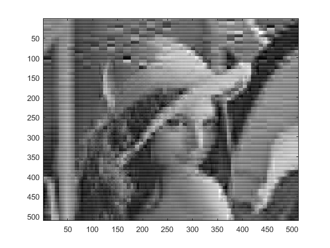

# fractalMapping

### Table of Contents:
1.  [Description](#d)
2.  [Comments on the code](#lc)
3.  [Library feautures](#lf)
	1. [regularFractal](#rf)
	2. [regularFractalWithRotation](#rfwr)
	3. [wavelet](#w)
	4. [letterMapping](#lm)
4.	[Sources](#sources)


<a name="d">
##1. Description
</a>

Set of libraries and code for running fractal compression and other related code. The fractal compression code is a lossy way of compressing images that keeps track of similarity of bigger blocks within an image to smaller blocks. By storing these similarities as mappings we can recreate an image that is very similar to the original image. 


Two core libraries (_blockImage.h_ and _compareImages.h_) have been created to allow for multiple flavours (_letterMapping_, _regularFractal_, _regularFractalWithRotation_, _wavelet_) of fractal compression with the help of class inheritance. The _blockImage.h_ library is used to read/write/manipulate images and _compareImages.h_ is the class responsible for generating the 'similarity' mappings as well as recreating an image given a mapping. The inheritance comes into play with _compareImages.h_. Classes that inherit from this define specific virtual methods that provide ways of determining optimal mappings and ways of generating images given mappings. The purposes of creating the core libraries was to provide an easy way of implementing new methods of fractal compression and image compression.


An image to showcase compression results will be ['Lenna'](http://www.cs.cmu.edu/~chuck/lennapg/lenna.shtml), a common test image used when working with image processing algorithms:


<a name="lc">
##2. Comments on the code
</a>

Each fractal compression code implementation stored in directories (_letterMapping_, _regularFractal_, _regularFractalWithRotation_, _wavelet_) contains a _compress.cc_ file and _decompress.cc_ file. _compress.cc_ is responsible for creating a fractal mapping and _decompress.cc_ is responsible for reading in a mapping and producing an image encrypted in the mapping. 


To compile the compress/decompress programs (within directory the program is located) run the following:


```
g++ -std=c++11 -o (de)compress (de)compress.cc ../blockImage.cc ../compareImages.cc
```

Some additional requirements and commands may be required for the directories.


<a name="lf">
##3. Library Features
</a>

Next few sections will discuss features and results of different fractal compression implementations. The algorithms written do not encode the mappings in the most space efficient format, but simple methods to do add this and results of such actions is discussed.


The fractal compression algorithms have a very 'slow' nature to them because they require finding optimal mappings between pixel blocks in an image. This requires checking all possible block to block comparisons. No additional comments on runtime will be made other than compress and decompress code can take a few seconds to run for a standart 512x512 pixel image such as 'lenna'.


<a name="rf">
###regularFractal
</a>

The algorithm takes in the original image and breaks it into 16 by 16 pixel blocks _B_. Then for all 8 by 8 blocks _A_ in the image, the algorithm finds the optimal _B_ such that when _B_ is blurred down to an 8 by 8 and transformed with a basic scaling and grayscale shift, it best approximates the _A_ block. These mappings are then written to file for each _A_ block in chronological order.


Each 8 by 8 block requires to store its approximating 16 by 16 block, scaling and grayscale shift. The values of scaling and grayscale are doubles (8 bytes) and approximating block number can be stored as an integer (4 bytes). This means that for each 8 by 8 block you need to store (8+8+4=20) bytes as an upperbound. For lenna, a 512 by 512 pixel image with 4096 - 8 by 8 blocks, that requires 4096*20=81920 bytes for mappings whereas lenna stores in png format requires 264069 bytes.  The compression can be optimized even further at the expense of precision. The code can be modified to limit the number of digits stored in scaling/grayscale in order to save space.


Once you have a mapping, you can then recreate the image approximation using _decompress.cc_ with any starting image such as the following:


The algorithm reads in the starting image, mappings and then for each 8 by 8 block _A_ in starting, grabs its matching 16 by 16 block _B_ and maps it onto the _A_ block. The starting image is then replaced with the results of mappings and the process is repeated multiple times to produce the following:


<a name="rfwr">
###regularFractalWithRotation
</a>


This feature is similar to regularFractal, except now the 16 by 16 blocks can be compared to 8 by 8 blocks by rotation as well. The mappings now also need to store how the 16 by 16 block was rotated. This adds an addition 2 bits per 8 by 8 block. A very negligible cost given that the decompressed image now looks much better than regularFractal(look at the lips and eyes). 


<a name="w">
###wavelet
</a>

The code in this sections requires the use of matlab in order to create the wavelet compression. It breaks an image into its wavelet decomposition and approximates the different levels by creating mappings between the child and parent levels.




<a name="lm">
###4. letterMapping
</a>

Given an image and a set of blocks, we can approximate the image with the best fitting blocks. In the example below we approximate 'lenna' with alphabet characters in 8 by 8 pixel blocks. The letter that is chosen to approximate an 8 by 8 block within 'lenna' is the letter than reduces the error when subtracting the difference between letter block and image block.


Hypothetically, a 512 by 512 pixel image with 4096 - 8 by 8 pixel blocks that takes up 264069 bytes in png format can be stored with 4096 characters. Each character takes a byte to store implying 4096 bytes of storage overall per image. You can observe that this compression comes with a huge expense in accuracy. Here is a [video](https://youtu.be/nBnlKsu7sYI) where each frame went through the letterMapping.


