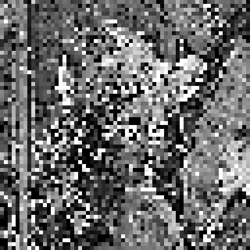
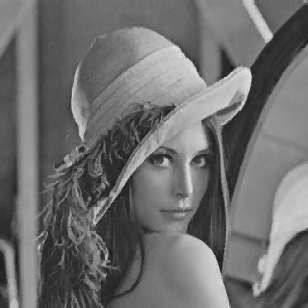
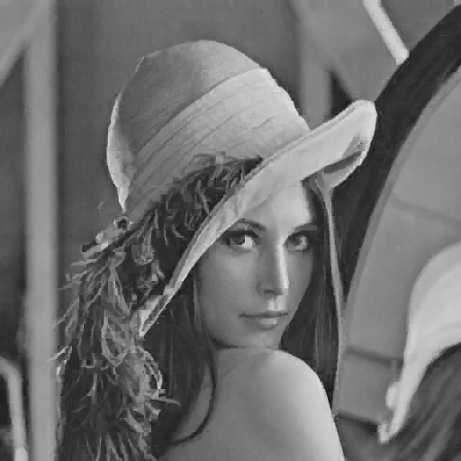

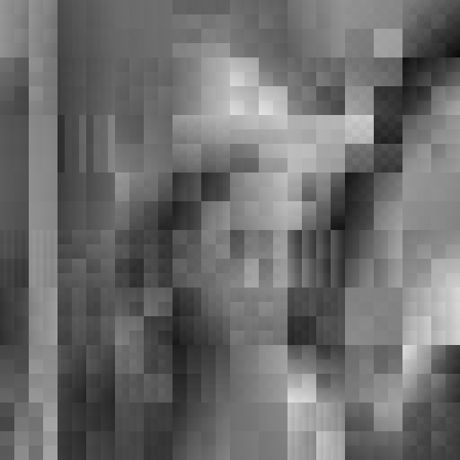
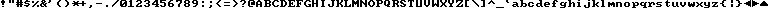
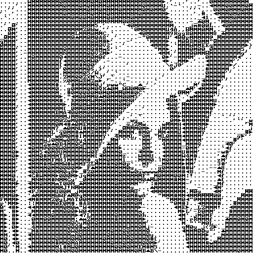

# fractalMapping

### Table of Contents:
1.  [Description](#d)
2.  [Comments on the code](#lc)
3.  [Library feautures](#lf)
	1. [regularFractal](#rf)
	2. [regularFractalWithRotation](#rfwr)
	3. [wavelet](#w)
	4. [letterMapping](#lm)


<h2>
<a name="d">
Description
</a>
</h2>

Set of libraries and code for running fractal compression and other related code. The fractal compression code is a lossy way of compressing images that keeps track of similarity of bigger blocks within an image to smaller blocks. By storing these similarities as mappings we can recreate an image that is very similar to the original image. 


Two core libraries (_blockImage.h_ and _compareImages.h_) have been created to allow for multiple flavours (_letterMapping_, _regularFractal_, _regularFractalWithRotation_, _wavelet_) of fractal compression with the help of class inheritance. The _blockImage.h_ library is used to read/write/manipulate images and _compareImages.h_ is the class responsible for generating the 'similarity' mappings as well as recreating an image given a mapping. The inheritance comes into play with _compareImages.h_. Classes that inherit from this define specific virtual methods that provide ways of determining optimal mappings and ways of generating images given mappings. The purposes of creating the core libraries was to provide an easy way of implementing new methods of fractal compression and image compression.


An image to showcase compression results will be ['Lenna'](http://www.cs.cmu.edu/~chuck/lennapg/lenna.shtml), a common test image used when working with image processing algorithms:


<h2>
<a name="lc">
Comments on the code
</a>
</h2>
Each fractal compression code implementation stored in directories (_letterMapping_, _regularFractal_, _regularFractalWithRotation_, _wavelet_) contains a _compress.cc_ file and _decompress.cc_ file. _compress.cc_ is responsible for creating a fractal mapping and _decompress.cc_ is responsible for reading in a mapping and producing an image encrypted in the mapping. 


To compile the compress/decompress programs (within directory the program is located) run the following:


```
g++ -std=c++11 -o (de)compress (de)compress.cc ../blockImage.cc ../compareImages.cc
```

Some additional requirements and commands may be required for the directories. Those requirements will be described when appropriate.

TODO:
input type
can only handle mod 8 by 8 images...

<h2>
<a name="lf">
Library Features
</a>
</h2>
Next few sections will discuss features and results of different fractal compression implementations. The algorithms written do not encode the mappings in the most space efficient format, but simple methods to add this and results of such actions is discussed.


The fractal compression algorithms have a very 'slow' nature to them because they require finding optimal mappings between pixel blocks in an image. This requires checking all possible block to block combinations. No additional comments on runtime will be made other than compress and decompress code can take a few seconds to run for a standart 512x512 pixel image such as 'lenna'.

<h2>
<a name="rf">
i. regularFractal
</a>
</h2>

<h5>
Compression (compress.cc):
</h5>
Here is a diagram that will be used to explain the algorithm:


<h6>
1.
</h6>
We start off with the original image (in this example it is 32 by 32 pixels) and split it into two copies. One with 8 by 8 pixels blocks and the other with 16 by 16 pixel blocks.

<h6>
2.
</h6>
We take the 16 by 16 split image and reduce each block to an 8 by 8 pixel approximation by averaging 2 by 2 pixel blocks into one pixel.

<h6>
3.
</h6>
For each possible pairing between an 8 by 8 block from original split and the 16 by 16 reduced split we compute a mapping. The mapping is defined as a scalar multiple <b>a</b> and grayscale shift <b>B</b> computed through simple linear regression (by treating each block as a vector). 


<h6>
4.
</h6>
We look at all of the possible mappings between a single 8 by 8 original split block <b>C</b> and all of the reduced blocks computed in part 3. We store the mapping for the <b>C</b> block that produces the smallest error. The error is defined as taking the Euclidean norm of the difference between <b>C</b> and the appropriate mapping(computed in part 3) on a reduced block. We need to store each ideal mapping for each <b>C</b> block. This requires storing the <b>a</b>, <b>B</b> and the position of the 16 by 16 reduced block (in our example the position of the green block in 16 by 16 split is 2).


<h5>
Compression rate:
</h5>
Each 8 by 8 block requires to store its approximating 16 by 16 block position, scaling and grayscale shift values. The values of scaling and grayscale are doubles (8 bytes) and approximating block number can be stored as an integer (4 bytes). This means that for each 8 by 8 block you need to store (8+8+4=20) bytes as an upperbound. For lenna, a 512 by 512 pixel image with 4096 - 8 by 8 blocks, that requires 4096*20=81920 bytes for mappings whereas lenna stored in png format requires 264069 bytes.  The compression can be optimized even further at the expense of precision. The code can be modified to limit the number of digits stored in scaling/grayscale in order to save space.

<h5>
Decompression (decompress.cc):
</h5>
Once you have a mapping, you can then recreate the image approximation using <i>decompress.cc</i> with any starting image such as the following:



The algorithm is very similar to the compression one and we can use the same diagram as in compression section to explain it:
<h6>
1.
</h6>

We grab the starting image and split it into two copies. The 8 by 8 split image is what we will be mapping onto and the 16 by 16 split image is where we will be mapping from. 

<h6>
2.
</h6>
We take the 16 by 16 split image and reduce each block to an 8 by 8 pixel approximation by averaging 2 by 2 pixel blocks into one pixel.

<h6>
3.
</h6>
For each 8 by 8 block in original 8 by 8 split we replace the block with the appropriate 16 by 16 reduced block described in mapping, multiplied by scale factor <b>a</b> and adding the grayscale shift <b>b</b>.


<h6>
4.
</h6>
After completing one round of mapping our 8 by 8 block split image will look something like this:




<h6>
5.
</h6>
To converge to the lenna image we need to set the 8 by 8 block original split as the new 'starting image'. Proceed to step 1. Repeat this about 20 times. After completing this we get the following result:




<h5>
Run:
</h5>
Compress (creates `map_output_extension` file that contains mapping):


```
cd regularFractal
g++ -std=c++11 -o compress compress.cc ../blockImage.cc ../compareImages.cc
./compress <input_file.pnm> <map_output_extension>
```

Decompress (creates `image_output_name_extension.pnm`):

```
cd regularFractal
g++ -std=c++11 -o decompress decompress.cc ../blockImage.cc ../compareImages.cc
./decompress <map_output_extension> <starting_image_pnm> <image_output_name_extension>
```

<h2>
<a name="rfwr">
ii. regularFractalWithRotation
</a>
</h2>

This feature is similar to regularFractal, except now the optimal mappings from 16 by 16 reduced blocks to 8 by 8 blocks can include rotation in addition to scaling and grayscale shift. The mappings now also need to store how the 16 by 16 block was rotated. This adds an additional 2 bits per 8 by 8 block. A very negligible cost given that the decompressed image now looks much better than regularFractal(look at the lips and eyes). 


<h5>
Run:
</h5>

Compress (creates `map_output_extension` file that contains mapping):

```
cd regularFractalWithRotation
g++ -std=c++11 -o compress compress.cc ../blockImage.cc ../compareImages.cc
./compress <input_file.pnm> <map_output_extension>
```

Decompress (creates `image_output_name_extension.pnm`):

```
cd regularFractalWithRotation
g++ -std=c++11 -o decompress decompress.cc ../blockImage.cc ../compareImages.cc
./decompress <map_output_extension> <starting_image_pnm> <image_output_name_extension>
```



<h2>
<a name="w">
iii. wavelet
</a>
</h2>
The code in this section requires the use of matlab in order to create the Haar-wavelet decomposition. The algorithm breaks an image into its wavelet decomposition. Then it constructs mappings between different levels of the wavelet decomposition by creating mappings between the child and parent levels (child is the smaller image block).

A 2 level wavelet decomposition may look something like this: 


Mappings between blocks within a child level and blocks within a parent level are constructed in a similar way to what was done in the fractalMapping section. However, this time we only compute the scaling factor (instead of simple linear regression, we find the line of best fit that crosses the origin). When reconstructing the parent blocks only given the smallest child blocks (top left), we recreate the parent sub blocks by iterating a single time by multiplying child blocks by scaling factor and mapping those onto parent blocks (unlike in fractal mapping where the decompression requires about 20 iterations).

Here is an example of lenna compressed using the wavelet approach and then decompressed. The wavelet decompression consisted of 4 levels where the bottom child was split into 1 by 1 pixel blocks. (Doing this caused a very slow runtime):



The results are not the best, but that can be blamed on the amount of levels used in the decomposition as well as the properties of Haar-wavelet decomposition.  The original 'lenna' in png format is about 264069 bytes, the stored mapping in this case takes up 173279 bytes which is poor given the results. Here is a more compact compression using 6 levels with a total mapping taking up 16326 bytes:




<h5>
Run:
</h5>
There is matlab involved in breaking the image down in addition to the C++ code. As a result the (de)compression steps are replaced with bash scripts. There is an additional restriction that images be of size 512 by 512.


Compress:

Creates the following

```
image_name---|
             |a------|a.txt
             |d------|d.txt
                     |mapping.txt
             |h------|h.txt
                     |mapping.txt                    
             |v------|v.txt
                     |mapping.txt
```

The compressed data is stored in the `*mapping.txt` and `a.txt`. 

image_name is the 'image' of 'path/to/image.pnm'.

```
cd wavelet
./compress.sh path/to/image.pnm
```
Decompress :


We need the wavelet directory to have the following layout
```
image_name---|
             |a------|a.txt
             |d------|mapping.txt
             |h------|mapping.txt
             |v------|mapping.txt
```

before running:

```
cd wavelet
./decompress folder_name
```

It will create 'result.png' in wavelet directory and modify previous file structure to:
```
image_name---|combined.txt
             |a------|a.txt
             |d------|new_d.txt
                     |mapping.txt
             |h------|new_h.txt
                     |mapping.txt                    
             |v------|new_v.txt
                     |mapping.txt
```


<h2>
<a name="lm">
iv. letterMapping
</a>
</h2>

Given an image and a set of blocks (block map), we can approximate the image with the best fitting blocks from the block map. In the example below we approximate 'lenna' with alphabet characters. The letter that is chosen to approximate an 8 by 8 block within 'lenna' is the letter than reduces the Euclidean norm when subtracting the difference between letter block and image block.


Block map:



Lenna approximation by using best fitting blocks from block map:





Hypothetically, a 512 by 512 pixel image with 4096 - 8 by 8 pixel blocks that takes up 264069 bytes in png format can be stored with 4096 characters. Each character takes a byte to store implying 4096 bytes of storage overall per image. You can observe that this compression comes with a huge expense in accuracy. Here is a [video](https://youtu.be/nBnlKsu7sYI) where each frame went through the letterMapping.

<h5>
Run:
</h5>

This code does not have a compress and decompress stage but instead just does the transformation in one stage. 'letters.pnm' is used as the block map (you can subsitute any other pnm file to replace it).

```
cd letterMapping
g++ map_image.cc -std=c++11 ../blockImage.cc ../compareImages.cc -o map
./map <file_input.pnm> <output_extension>
```

Produces `output_extension` file (include .pnm in `output_extension`)


